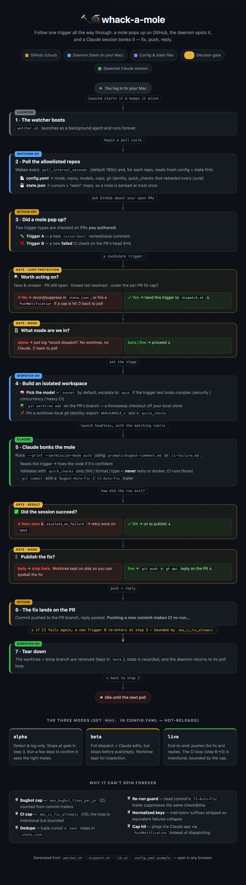

# whack-a-mole

Moles keep popping up on your PRs — Cursor bugbot findings, failing CI checks. `whack-a-mole` watches for them and bonks each one with a Claude session before you have to.

A small bash daemon polls allowlisted GitHub repos every few minutes. When it sees a new `cursor[bot]` comment or a failed CI check on a PR **you authored**, it spawns a headless Claude session in an isolated git worktree on that PR's branch, fixes the issue, and pushes a commit co-authored by Claude. If it can't fix confidently, it pings you via the Claude app and tags you on the PR instead. Sonnet by default; escalates to Opus when the trigger looks complex.



<sup>Source: [`docs/architecture.html`](docs/architecture.html) — open in a browser for the interactive version.</sup>

## Requirements

macOS (launchd; trivial to port to systemd), plus `bash`, `git`, `gh` (authenticated), `jq`, `yq`, `claude`.

```bash
brew install gh jq yq
gh auth login   # if not already
```

## Install

```bash
git clone https://github.com/markphilipp/whack-a-mole.git ~/Projects/whack-a-mole
cd ~/Projects/whack-a-mole
./install.sh          # validates deps, symlinks repo, renders launchd plist, scaffolds config.yaml
# edit config.yaml — set my_github_login, git_user(_email), and your repos
./install.sh --load   # start the watcher via launchd
```

`config.yaml` is gitignored; `config.yaml.example` is the committed template. The daemon reads `config.yaml` in place through the `~/.claude/whack-a-mole` symlink and hot-reloads it every poll cycle — no restart needed to change `mode`, caps, triggers, or repos.

## Config

Full schema (with comments) lives in `config.yaml.example`. The fields you'll touch most:

| Field | What it does |
|---|---|
| `mode` | `alpha` detect-only · `beta` dispatch but no push/reply · `live` end-to-end |
| `models.default` / `.escalation` | Primary model (`sonnet`) and escalation model (`opus`) |
| `models.intelligent_switching` | Start directly on the escalation model when trigger text looks complex (security/concurrency/heavy CI) |
| `models.escalate_on_failure` | Retry once on the escalation model if the default-model run exits non-zero |
| `only_my_prs` / `my_github_login` | Only act on PRs whose author is you |
| `git_user` / `git_user_email` | Commit author name/email for auto-fix commits; per-repo `repos[].git_user_email` overrides the email |
| `max_bugbot_fixes_per_pr` / `max_ci_fix_attempts` | Loop caps (default 2 / 10) |
| `poll_interval_seconds` | Poll cadence per repo (default 180) |
| `repos[]` | `github` slug, `local` clone path, optional `worktree_setup`, and `quick_checks` |
| `triggers.bugbot_comments` / `.ci_failures` | Toggle each trigger type |

**Rollout:** start in `alpha` for a few days and tail `~/.local/state/whack-a-mole/logs/watcher.log` to confirm it detects the right triggers (and ignores dependabot/teammates). Move to `beta` to eyeball a real auto-fix kept on disk, then flip to `live`.

**`quick_checks`** are the *only* commands the spawned Claude may run to validate a fix — linter / formatter check / type checker, file-scoped and fast (use `{changed}` for changed paths). Tests and docker are never run here (CI owns those) and are blocked via `--disallowed-tools`. To add a repo, append to `repos[]` with a clean `local:` checkout; it's picked up next poll.

## Loop protection

The CI fix → rerun → fix cycle is intentional but bounded. Every auto-fix commit carries a trailer — `Bugbot-Auto-Fix: <comment_id>` or `CI-Auto-Fix: <check>@<sha>` — and caps are counted from those. `state.json` cursors + per-repo `seen` maps dedupe replays, normalized check names collapse matrix/env variants, and a head commit's `CI-Auto-Fix:` trailer suppresses the same `check@sha`. When a cap is hit, the watcher fires a `PushNotification` instead of dispatching another fix.

## Layout

Source (this repo):

```
├── watcher.sh / dispatch.sh / lib.sh    polling loop · per-trigger handler · shared helpers
├── prompts/{bugbot-comment,ci-failure}.md   rubrics handed to the spawned Claude
├── config.yaml.example                  committed template (config.yaml is gitignored)
├── launchd/com.markphilipp.whack-a-mole.plist.template   rendered into LaunchAgents at install
└── install.sh / uninstall.sh
```

Runtime (after `install.sh`): the repo is symlinked to `~/.claude/whack-a-mole`, the plist is rendered (with `$HOME` substituted) into `~/Library/LaunchAgents/`, and state + logs live under `~/.local/state/whack-a-mole/` (`state.json`, `logs/watcher.log`, `logs/dispatch-*.log`).

## Troubleshooting

| Symptom | Try |
|---|---|
| `launchctl list \| grep whack-a-mole` shows nothing | `launchctl load ~/Library/LaunchAgents/com.markphilipp.whack-a-mole.plist` |
| Watcher running but nothing detected | tail `watcher.log`; confirm `gh auth status` works; confirm `mode`/`only_my_prs` settings |
| Dispatch creates worktree but Claude does nothing | tail the matching `dispatch-*.log`; check `WHACKAMOLE_*` env vars are set; check `claude` is on the PATH listed in the plist |
| Same trigger fires repeatedly | check the trailer was committed correctly (`git log --format='%(trailers)' origin/<branch>`); state file may be stale (`rm ~/.local/state/whack-a-mole/state.json` to reset) |
| Stuck worktrees | `cd <repo> && git worktree list` and `git worktree remove --force <path>` |
| Want to stop the daemon | `launchctl unload ~/Library/LaunchAgents/com.markphilipp.whack-a-mole.plist` |

## Uninstall

```bash
~/Projects/whack-a-mole/uninstall.sh          # remove symlinks + launchd, keep state
~/Projects/whack-a-mole/uninstall.sh --purge  # also delete state dir
```
